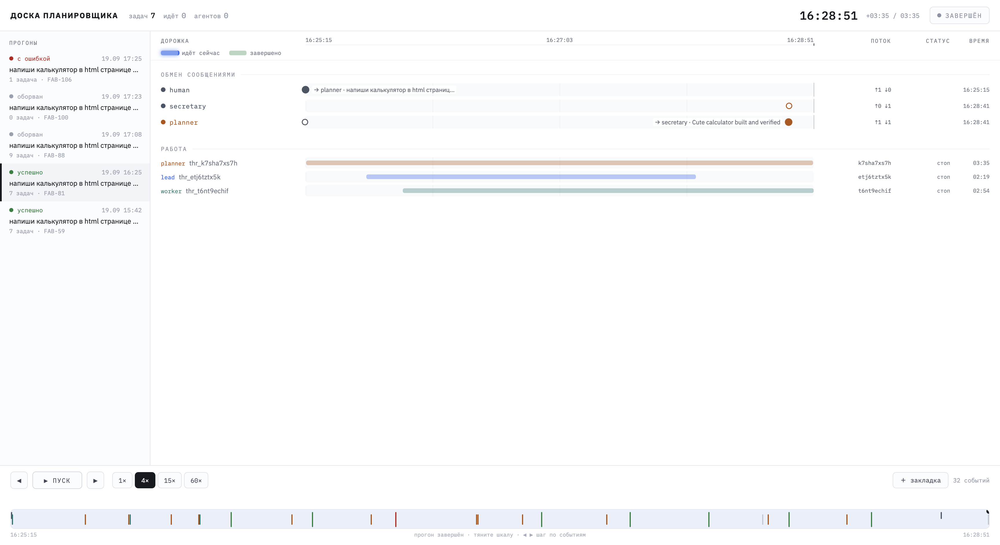

# The factory

A board of tasks, a planner that fills it, agents that take the tasks, and a secretary that talks to the
person whose factory it is. Give it a goal and a git repository; it plans the work, runs a dozen coding
agents in parallel worktrees, merges what they finish, asks you what only you can decide, and reports.

Every agent is a [bb](https://getbb.app) thread. The factory owns the board and the merges; bb owns the
threads and the models.

This file is the door. Everything else is in `docs/`, an [OKF](https://github.com/inkeep/open-knowledge-skills)
bundle: **[docs/index.md](docs/index.md)** is the way in, and every directory below it has an index of its
own. Nothing here is repeated there — if you want to know how a part works, follow the link to it.

## What it looks like running



Nobody talks to anybody directly: every word goes through the board, which is why a run can be replayed
from its files and picked back up after its board is gone. The topology and one run as a sequence are the
two diagrams in [docs/architecture/overview.md](docs/architecture/overview.md), which is also where the
roles, the tick, the tools and the state files are described.

## A run

```python
# factory/construct.py
run(goal, power_real, Path.home() / "w/learning/meditate", slots=10, kit=IOS)
```

```
.venv/bin/python -m factory.construct        # the board; it ticks every 10 seconds until the report
.venv/bin/python -m factory.ui.serve         # the timeline of the run, live, on :8877
```

Everything the board knows goes to `state/runs/<started>/`, and `Board.resume()` picks a run back up
after its board is gone.

## Getting started

Needs [bb](https://getbb.app) on `PATH`, Python 3.13 and [uv](https://docs.astral.sh/uv/).

```
uv sync
.venv/bin/python -m pytest -q                # the check
```

The Telegram bot is optional and lives outside the repository: put `FACTORY_TELEGRAM_TOKEN=…` in
`state/telegram.env` and write to the bot once — whoever writes first owns the chat. Without it a run
works, and the secretary has nobody to ask.

`do.py` runs one agent on one task with no board, for trying a prompt.

## What it has built

- `ios-kit` — the factory's own ground for iOS work: skills tried and kept, a starter, a measured
  build-test-tap loop on one Mac. [The plan and what it cost](docs/decisions/ios-kit-run.md).
- Meditate — an iPhone app that plays guided meditations, with the titles transcribed from the audio, an
  icon family generated against a reference, and Apple Health. 41 tasks, six hours, 47 threads.
  [What the run taught](docs/decisions/meditate-run-lessons.md).

The run-lesson files in [docs/decisions/](docs/decisions/index.md) are the honest ones: every plan that
shaped the factory is there in the order it was made, with the boxes it ticked and the ones it did not.

## License

MIT. The skills under `.pi/skills/` and `.agents/skills/` are vendored from their own authors and keep
their own licenses.
